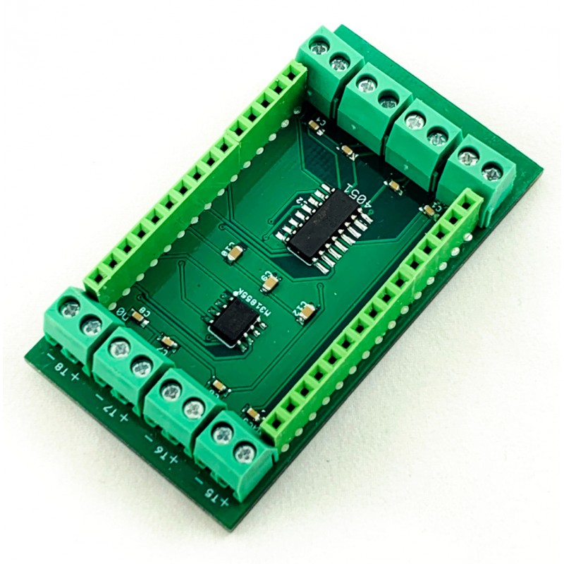

**WiFi Thermocouple Multiplexer Shield**

For more details, check out the product page at

https://makerstorage.com/index.php?id_product=35&controller=product

MakerStorage invests time and resources providing this open source design, please support MakerStorage and open-source hardware by purchasing products from MakerStorage!

Designed by MakerStorage LLC.

Creative Commons Attribution, Share-Alike license, check https://creativecommons.org/licenses/by-sa/3.0/ for more information All text above must be included in any redistribution

This Shield is designed to easily allow multiple high-temperature readings with an ESP8266 control board. Screw terminals are provided for thermocouple connections.

* Multiplexing seven K-type thermocouples (Can read all sensors under a second)
* Wifi capability (example firmware for local server and Amazon AWS IoT)
* Suitable for only Lolin models of ESP8266 (27mm between headers)
* Onboard Max31855KASA  Cold-Junction Compensated Thermocouple-to-Digital Converter
* Works with K type thermocouples
-200°C to +1350°C output in 0.25 degree increments - note that K thermocouples have about ±2°C to ±6°C accuracy

**Areas to use:**

* Automotive – Engine, Exhaust and Brake temperatures

* Ovens, Furnaces, and Kilns

* Freezer or Cryogenic monitoring

* Chemical Processes

* IoT applications like Multi-Zone Temperature Monitoring, Data Acquisition or Logging Systems

